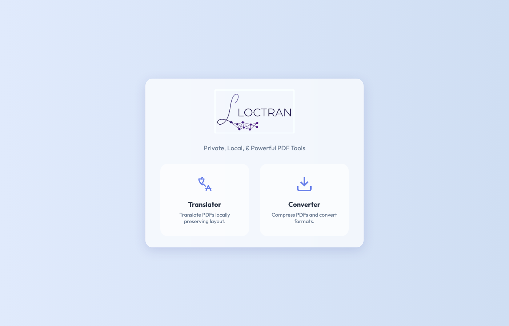
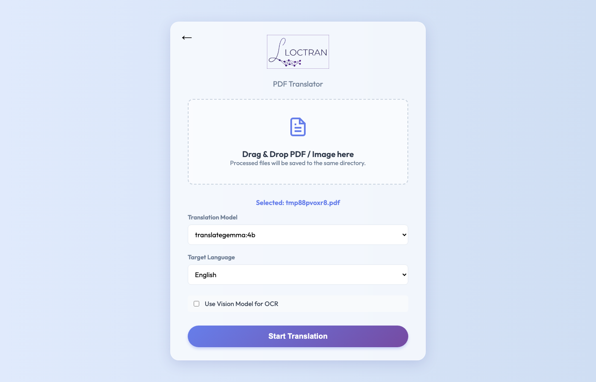
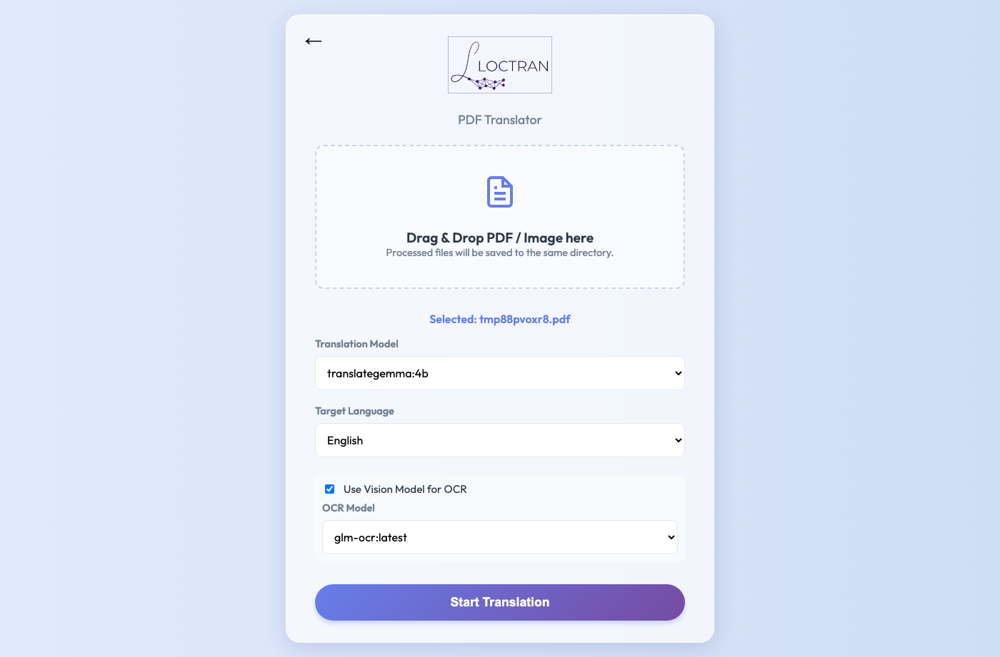
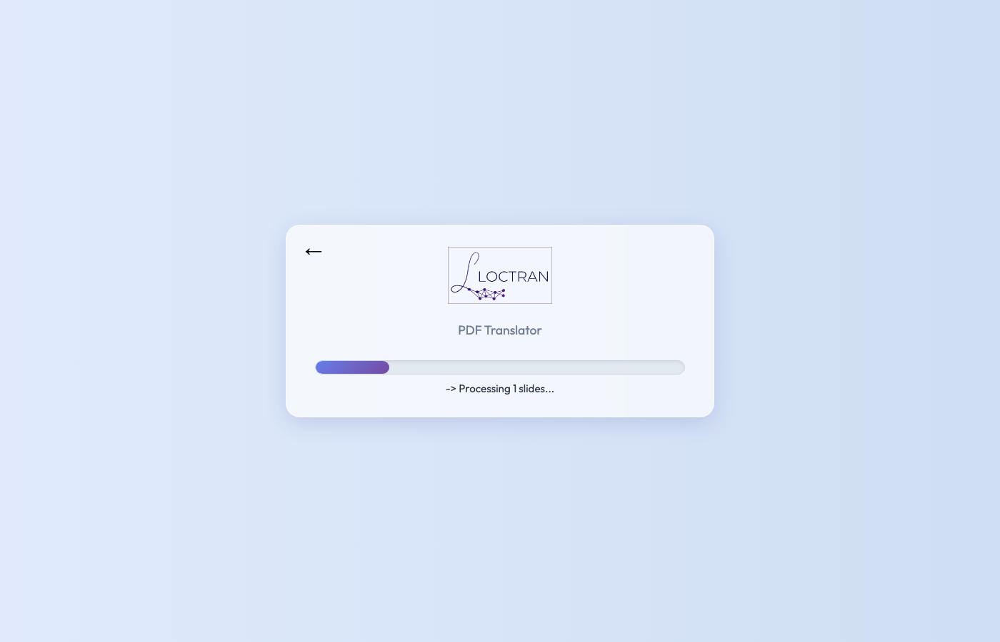
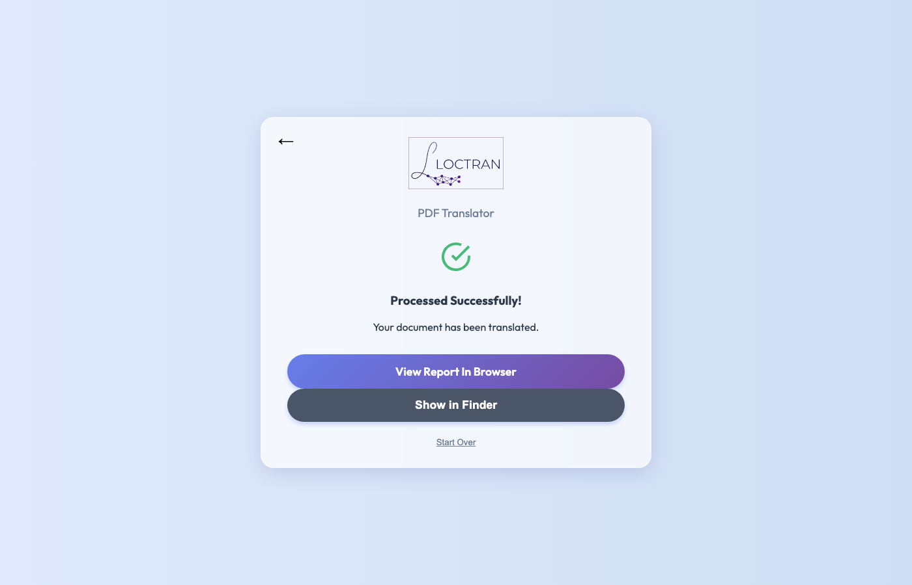
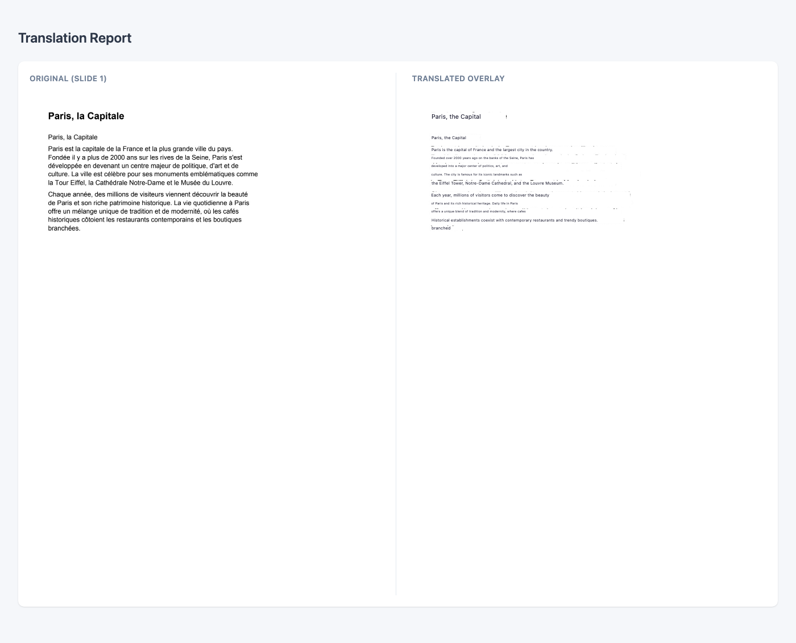

# Loctran — private AI PDF translator

[](https://github.com/anzalks/loctran/actions/workflows/ci.yml)
[](https://pypi.org/project/loctran/)
[](LICENSE)
[](https://pypi.org/project/loctran/)

**Translate PDFs locally. No cloud. No API key. Just Ollama.**

## Features

| What it does | Why it matters |
|---|---|
| Rasterises PDFs with pypdfium2 | No Poppler / Ghostscript dependency |
| Dual-pass OCR (Tesseract + inverted image) | Catches light-on-dark and low-contrast text |
| Batched LLM translation via Ollama | Works with any local chat model |
| HTML overlay output | Translations positioned over the original layout |
| Web UI with real-time progress | Upload and translate from any browser |
| PDF compression | Reduce file size without proprietary tools |
| **100 % local — files never leave your machine** | Full privacy, no API keys, works offline |

---

## Screenshots

| 1. Home | 1.1 PDF Upload |
|---|---|
|  |  |

| 2. Translation Configured | 2.1 Translation In Progress |
|---|---|
|  |  |

| 3. Result | 3.1 Translation Complete |
|---|---|
|  |  |

---

## 30-second install

The default install includes the Web UI. A plain `pip install loctran` is enough to start the app.

```bash
pip install loctran
ollama pull glm-ocr
ollama pull translategemma:4b
loctran
# opens Web UI at http://127.0.0.1:8000
```

```bash
# CLI translation example
loctran translate document.pdf --lang French
```

---

## How it works

```
PDF
 └─► rasterise pages (pypdfium2)
      └─► dual-pass OCR (Tesseract normal + inverted)
           └─► deduplicate & group words into segments
                └─► batch translate (Ollama LLM)
                     └─► HTML overlay output
```

Each page becomes an image with absolutely-positioned translation boxes sized to match the original text bounding boxes. For PDFs with a digital text layer, pdfplumber extracts text directly — no OCR needed.

---

## Requirements

- **OS**: macOS, Linux, or Windows
- **Python** ≥ 3.9
- **Ollama** running locally — [download](https://ollama.com/download)
- **Tesseract** — `brew install tesseract tesseract-lang` (macOS) or `apt install tesseract-ocr tesseract-ocr-all` (Linux)

On startup, Loctran will try to start Ollama if it is installed and will pull the configured OCR and translation models when they are missing. The first launch still depends on the user having Ollama available and network access for any model downloads.

Run `loctran doctor` to check everything at once:

```
loctran-doctor v0.1.1b8
─────────────────────────────────────
✓  Python         3.11.9
✓  Tesseract      5.3.4  (langs: eng fra deu jpn +47)
✓  Ollama         0.3.1  (running)
✓  glm-ocr        pulled (2.2 GB)
✓  translategemma:4b pulled (3.3 GB)
─────────────────────────────────────
All required dependencies satisfied.
```

---

## Web UI

Start the server and open your browser:

```bash
loctran serve
# → http://localhost:8000
```

Upload a PDF, choose a target language and model, then watch the real-time progress bar. The translated HTML opens automatically when done.

---

## CLI reference

```
Usage: loctran [OPTIONS] COMMAND [ARGS]...

Commands:
  serve      Run the local web UI server.
  translate  Translate a file or folder using local OCR + Ollama.
  doctor     Run environment diagnostics for dependencies and models.
```

```bash
# Translate to Spanish using a higher-quality translation model
loctran translate report.pdf --lang Spanish --model translategemma:12b

# Extract text only, save to custom folder
loctran translate scan.pdf --extract-only --output ~/Desktop/extracted

# Use smaller batches to avoid context overflow on long documents
loctran translate book.pdf --lang German --batch-size 3

# Run dependency diagnostics
loctran doctor
```

## Updating README screenshots

```bash
pip install -e ".[dev]"
python -m playwright install chromium
make screenshots
```

This writes screenshots to `docs/screenshots/` using `scripts/capture_screenshots.py`.

---

## FAQ

**Does this send my documents anywhere?**
No. Everything runs locally on your machine. Loctran talks only to Ollama at `localhost:11434`. No telemetry, no analytics, no cloud.

**Which Ollama models work?**
Any locally installed Ollama model appears in the Loctran model picker automatically. Run `ollama list` to see what is available. For this project, use `glm-ocr` for OCR and `translategemma:4b` for translation. On 16 GB+ machines, `translategemma:12b` is the higher-quality option.

**What about scanned PDFs?**
Loctran automatically detects whether a PDF has a digital text layer. If it does, pdfplumber extracts text directly (fast, accurate). If not — or if you pass `--force-ocr` — Tesseract runs a dual-pass OCR (normal + inverted image) to catch light-on-dark text. Pass `--use-ai-ocr` to route OCR through an Ollama vision model for the highest accuracy on complex layouts.

---

## Docker

```bash
docker run -p 8000:8000 -v ~/Documents:/docs ghcr.io/anzalks/loctran
```

---

## Contributing

See [CONTRIBUTING.md](CONTRIBUTING.md) for development setup, running tests, and submitting PRs.

---

## License

[](LICENSE)

Apache 2.0 — © 2026 Anzal K Shahul
